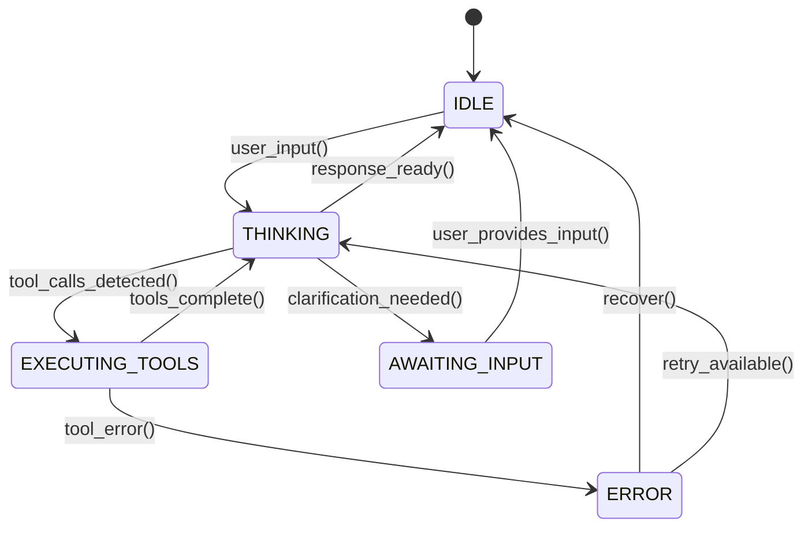

# State Machine Contract

## States



## Callbacks

Each state transition fires a callback:

```python
@dataclass
class StateTransition:
    from_state: AgentState
    to_state: AgentState
    reason: str
    timestamp: datetime
    metadata: dict  # Context-specific data (e.g., tool results, error info)

# Registered callbacks receive StateTransition
callbacks.on_state_change(transition)
```

## Error Recovery

| Error | Recovery Action |
|-------|----------------|
| Tool execution timeout | Log, transition to ERROR, prompt user to retry |
| Provider rate limit | Wait, retry (up to retry_attempts) |
| Provider auth failure | Transition to ERROR, show configuration help |
| Unknown tool call | Skip tool, log warning, return to THINKING |
